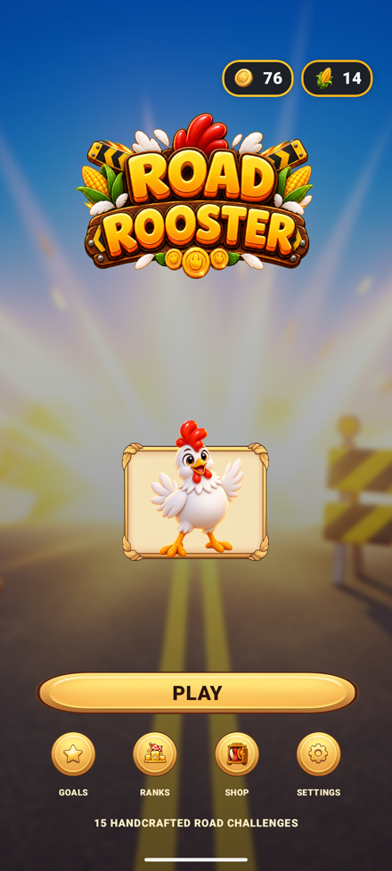
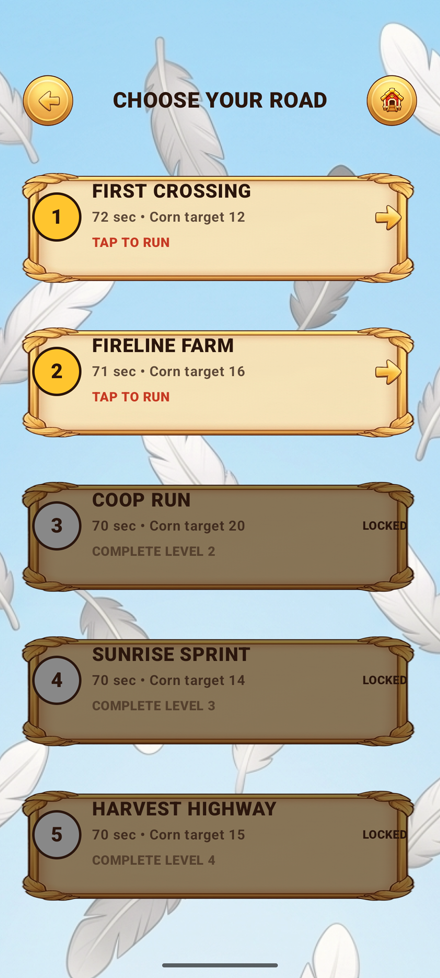
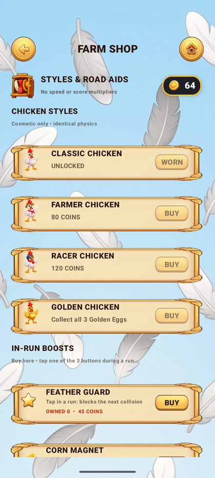

# Road Rooster

A portrait arcade runner where an expressive chicken crosses an increasingly chaotic road, reading timing and lane choice instead of grinding score multipliers.

Players swipe to hop lanes, jump barriers, or dive under gates, using a deterministic fixed-step engine tuned for fair, readable hazards rather than reflex-punishing randomness. Fifteen authored ~70-second roads escalate speed and hazard density while teaching every mechanic explicitly in Level 1. Progression is built entirely on cosmetics, achievements and a local leaderboard — the design deliberately excludes combo/streak scoring, endless mode, ads, IAP and any network dependency.

## Screenshots

<p align="center">
  
  
  
  
</p>

## Features

- Three-lane swipe controls: buffered 0.18s lane hop, a 1.35s ballistic jump with a forgiving intent window, and a staged 0.62s dive, with mutually exclusive jump/dive input and a 160ms input buffer
- 15 deterministic, hand-authored ~70-second levels, each with its own Golden Egg, Corn objective, route splits and one-shot traffic/tire hazards
- Context-aware tutorial in Level 1 ("JUMP NOW" / "DIVE NOW") computed from live hazard distance rather than fixed timers
- Four cosmetic chicken skins (Classic, Farmer, Racer, Golden) with fully unique idle/run/jump/dive/hit/win art, purely cosmetic — no gameplay effect
- Two single-run Road Aids (Feather Guard, Corn Magnet) purchasable with earned Coins, consumed on use, with no speed or score effect
- 12 lifetime-stat achievements and a local per-level leaderboard tracking best time, Coins, Corn and Golden Egg status
- Custom Canvas-based gameplay renderer with a shared camera/collision projection and DataStore-backed save data

## Tech Stack

- **Language:** Kotlin
- **Platform:** Android (minSdk 24, targetSdk 35)
- **Engine / framework:** Jetpack Compose shell with a custom Canvas gameplay renderer
- **Build:** Gradle (Kotlin DSL)
- **Persistence:** AndroidX DataStore (Preferences)

## Project Structure

```
app/src/main/                # Application source (Compose UI, gameplay engine, art catalog)
app/src/main/res/            # Levels, sprites, cosmetic sets, audio
docs/ (GAME_DESIGN.md, ...)  # Design spec, art direction, asset map
qa / test-output             # QA checklists and packaging test evidence
tools/                       # Release art optimization and APK packaging scripts
```

## Building

```bash
git clone https://github.com/brah1995u/road-rooster.git
cd road-rooster
./gradlew assembleDebug
```

The APK lands in `app/build/outputs/apk/debug/`.

## Status

Feature-complete: all 15 levels, four cosmetic sets, shop, achievements and leaderboard are implemented and reachable. A release build has passed signed-APK packaging QA (51 unit tests, lint, signature/zipalign checks, install and playthrough smoke test on an emulator); a full multi-device, all-levels certification pass has not been performed.
